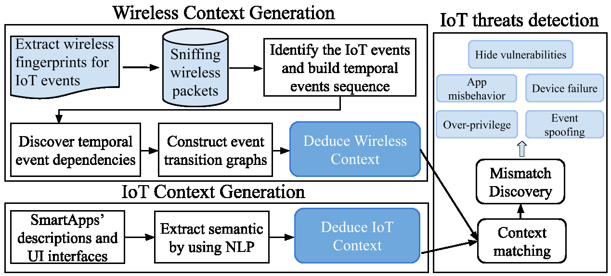
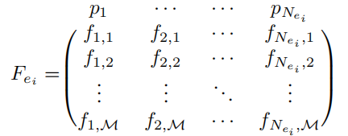
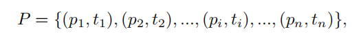
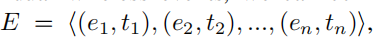
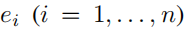
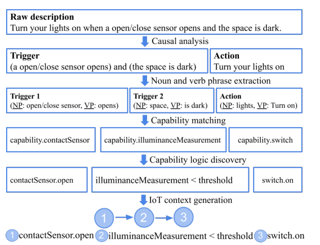

## iotGaze概述

**IoTGaze**的新型框架，可通过无线流量分析发现物联网系统中的潜在异常与漏洞。通过嗅探加密的无线流量，IoTGaze能自动识别应用程序与设备间事件的顺序交互。我们揭示了时序事件依赖关系，并为物联网系统生成 **无线上下文** （ *Wireless Context* ）。同时，通过分析物联网应用的描述与用户界面（UI），我们提取反映用户期望的 **物联网上下文** （ *IoT Context* ）。若无线上下文与预期的物联网上下文不匹配，IoTGaze将报告异常。此外，IoTGaze还能通过温度、光照等隐藏通道发现由应用间交互引发的漏洞。我们在三星SmartThings平台上实现了原型系统并进行评估。实验表明，IoTGaze能有效检测异常与漏洞，显著提升物联网系统的安全性。

## 1.引言

### **IoTGaze**框架，其核心步骤如下：

1. **无线流量特征提取** ：从加密流量中提取特征，生成交互事件序列；
2. **无线上下文构建** ：通过时序事件依赖关系建立无线上下文；
3. **物联网上下文提取** ：IOTGaze通过从IOT_app描述和UI中提取用户所期待的IOT上下文与侦测到的无线上下文进行对比，从而发现异常；
4. **异常与漏洞检测** ：通过无线事件依赖分析发现隐藏漏洞。

## 2.威胁模型

- IOT相互作用链（设备，app，IOT平台）

### 2.1安全和隐私事件：

**(a) 应用不当行为**
例如：当户主在家时，应用应关闭监控以防止隐私泄露。但应用可能未关闭监控，仍持续监控户主活动并将数据上传至外部服务器。

**(b) 事件欺骗**
攻击者可能向物联网中枢伪造"presence_not_present"指令，导致中枢关闭监控。随后入侵者可闯入房屋。

**(c) 权限过度**
应用可能向平台请求无关能力权限（例如门锁控制权限）。当户主离家时，应用可能错误地解锁门锁，引发严重安全问题。

**(d) 设备故障**
硬件缺陷和软件漏洞可能导致设备故障。攻击者也可通过攻击使设备（例如监控摄像头）无响应。

**(e) 隐藏漏洞**
此类漏洞由多个应用通过温度、光照等隐藏通道同时交互引发。例如：某温控应用在冬季晚8点后自动开启暖气，另一应用在室温超过90°F时自动开窗。室内温度是物理通道，攻击者可伪造指令事件使暖气持续工作，导致温度升高，最终触发开窗并实施入侵。

## 3.系统概述

### 3.1无线上下文生成

    三个子任务：

(1) *如何将无线流量与物联网交互事件关联并生成事件指纹？*
我们利用加密无线流量中的**有限特征**生成有效指纹以检测物联网事件。

(2) *如何通过连续数据包生成连续的物联网事件序列？*
我们嗅探的是无线数据包序列，但漏洞检测需基于事件。因此我们设计了一种方法来**自动分割数据包序列**并生成时序事件序列。

(3) *如何发现时序事件依赖关系并生成无线上下文？*
我们设计了一种**事件依赖发现方法**，可精确提取事件间的因果关系，构建无线上下文图。

**物联网上下文生成**
**物联网上下文反映用户期望的应用行为**，可能与实际执行行为不符。恶意应用可能虚假描述功能但暗中执行恶意操作。为准确提取物联网上下文，我们***分析应用描述和用户界面（UI）***——这些内容直接面向用户且通常无法篡改。我们使用自然语言处理（NLP）技术从应用描述和UI中提取物联网上下文，并构建反映用户预期逻辑的事件转移图。

**异常与漏洞检测**
物联网上下文代表用户预期的自动化服务，无线上下文揭示实际发生的服务。每个上下文通过一组事件转移图表示。我们提出一种通过对比不同上下文下事件转移图来发现不匹配和异常的方法。进一步分析可发现由应用间交互引发的隐藏漏洞（例如通过温度、光照等物理通道形成的攻击链），从而在攻击发生前实施防御。下文将详细阐述各组件。

## 4.无线上下文生成

- 第三方检测者：嗅探加密的无线包，并存储包序列，分析包序列产生无线上下文（一系列的事件转化图）
  - **A. IOT事件指纹**   事件驱动的智能程序会从不同的以IOT中心作为中介的传感器中接受数据。   **IOT事件** 我们将物联网事件定义为物联网中心通过无线通信与传感器和执行器交互的活动。
    使用包序列$P_{e_i}={p_1,p_2,...,p_i,...,p_{N_ei}}$ 来代表一个特定事件$e_i$的流量。提取除加密数据以外的信息来确定事件的指纹。
    这些信息包括
    1. 包大小
    2. 包方向
    3. 包间隔
    4. 包的层（应该是传输层，应用层等）
    由此生成如下指纹（$N_{e_i}$代表事件$e_i$的包数量，M代表通信协议的特征数量）：
    
    之后使用随机森林机器学习模型作为分类器$C$，且将$F_(e_i)$填充到大小为$N$
   - **B. 顺序事件生成**   
     嗅探包序列
     
     用一个最大$N$个包的滑动窗口，将其划分为一个矩阵，之后让分类器$C$给他划分为一个个事件
   - **C. 时间事件依赖性检测**  
     将事件拆分出来之后，构造一个事件流，$t_i$为事件发生时间：
     
     
     $e_i和e_j$可以是发生在不同时间的同一事件
     时间事件依赖意味着一组事件按照一定次序一起发生
     两类时间之间有时序依赖的话那么二者之间的间隔服从正态分布，方差大概等于网络延迟的方差，与事件类型无关。两个事件方差小于门限值的话认为二者具有时间依赖性。
     $[a,b]$代表一组依赖事件
     那么如果$[a,b]$且$[b,c]$且$\mu (a,c)=\mu (a,b)+\mu (a,c)$那么[a,b,c]
     若$[a,b,c,d]$发生100次，$[b,c,d]$发生100次，$[c,d]$发生150次那么认为$[b,c,d]$不是依赖序列，但是$[c,d]$是。
     之后生成无线上下文，按照事件依赖生成事件转移图（可以反应真实事件）。
## 5.IOT上下文生成
    即用户所期待的IOT自动服务。

    - **A. 应用描述分析**
    大部分应用遵循IFTTT模式（if-This-then-that）
   从描述中获取因果关系（识别描述中的条件句——传感器的变化与主句——设备相应），使用Stanford解析器来分析句子结构，分成简单句和从句。但是此时是人可读的而不是，机器可读的。
   
    - **B. 功能匹配**
  我们根据Word2Vec [18]模型计算的相似度分数将名词短语和动词短语与能力相匹配。一旦我们有每个短语和能力对的相似性得分，我们就将子句匹配到最相似的能力。对于每个子句，如果最相似的功能已经被其他一些功能所采用，则选择第二个最相似的功能。

    - **C.时间转移图生成**
  从动词短语中寻找命令。

  完整流程：
  

## 6.异常与漏洞检测
  Iot_context: $G=\{g_1,g_2,...,g_i,...\}$，$g_i$代表相应的交互事件
  wireless_context: $G^`=\{d_1,d_2,...,d_i,...\}$，$d_i$代表相应的交互事件
    检查$G^`$中的事件$d_j$是否与$G$中的$g_i$具有相同的ID和相同的依赖。如果没有这样的关联，我们就认为系统中有一个潜在的异常。
    该方法可以检测隐藏信道所导致的漏洞。

## 7.评测
   - A. 异常检测评测：
   （感觉这段对于理解整篇的概念用处不大，便没有整理）
  